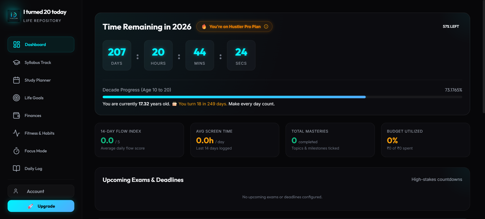

# ⚡ I turned 20 today

An aesthetic, high-productivity personal workspace and life tracker designed to help you stay focused, disciplined, and aligned with your life goals. Framed around a ticking year countdown and a Git-style contribution graph, it visualizes your progress and holds you accountable every single day.



## ✨ Features
* **🎓 Syllabus & Study Tracks:** Keep all your academic requirements and learning paths organized.
* **📅 Goal Planner:** Break down huge life goals into actionable, trackable milestones.
* **💰 Finance Tracker:** Keep tabs on your budget, spending habits, and savings goals.
* **🏃‍♂️ Fitness & Habits:** Build consistency with daily streaks and workout tracking.
* **⏱️ Pomodoro / Focus Mode:** Built-in timer to maximize deep work.
* **📖 Daily Log:** Journal your thoughts, reflect on your progress, and review your days.

## 🚀 Pro Plan 
> **Note:** The app is currently in active development. Therefore, **all Pro Plan features are currently 100% free to try for everyone!** Enjoy the premium experience! 

## 🛠️ Tech Stack
* **Frontend:** Vanilla JavaScript, HTML, CSS (Glassmorphism & Neon Design System)
* **Backend / Auth:** Supabase
* **Hosting:** Netlify
* **Icons:** Lucide Icons

## 💻 Running Locally

1. Clone the repository:
   ```bash
   git clone https://github.com/muzammiltanwar/iturned20today.git
   cd iturned20today
   ```

2. Install dependencies:
   ```bash
   npm install
   ```

3. Setup environment variables:
   Create a `.env` file in the root directory and add your Supabase credentials:
   ```env
   VITE_SUPABASE_URL=your_supabase_url
   VITE_SUPABASE_ANON_KEY=your_supabase_anon_key
   ```

4. Start the development server:
   ```bash
   npm run dev
   ```
